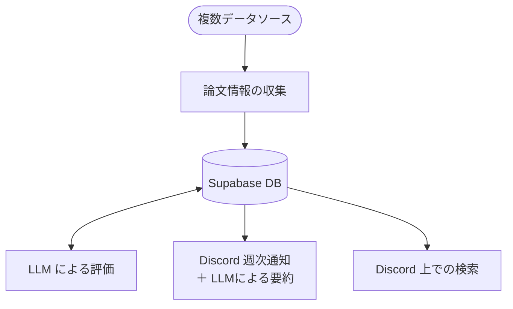

# トピック別論文週次通知bot（特に言語学）

**This is an experimental prototype.**

論文等の文献情報を複数のデータソースから定期的に（日時等で）収集し，Discord に定期的に（週次等で）通知するシステムです．LLM を用いたトピック関連度評価，チャンネル別の配信設定（＋アブスト要約）等に対応します．

現在は，言語学分野に関するキーワード等を一部スクリプト内の定数として設定しています．

副次的な機能として，Discord のスラッシュコマンドを用いたキーワードベースの論文検索・一覧表示も備えています．

---

## 1. 概要・設計

### 背景

開発のはっきりした出発点は，新着論文のDiscord通知に関する希望を聞いたことす[^1]．

[^1]: また，当時 ChatGPT 等による文献クロールでハルシネーションが生じたとも聞いたので，文献の収集は確実にできるようにと考えました．

これをもとに，複数データソースからの論文情報の収集・蓄積・抽出・通知を行うシステムとして設計・実装・とりあえず動作確認しています．

### 設計方針

本システム（システムと言っていいのか？）は，以下の方針で設計しています．

* 完全無料での運用を前提とする
* 研究会等での複数人での運用を想定する
* ローカル環境構築なしで内容を変更できるようにする
* 網羅性の追求は妥協し，「新しい論文を知る」ことを優先する

### 処理概要

基本的な処理は大まかに以下の通りです．



1. **日次収集**  
   GAS `dailyCollect` で各データソースから論文を取得し，Supabase に蓄積する．
2. **LLM 評価**  
   Cloudflare Worker を用いて，未評価の論文とトピックの組み合わせに対し，Groq で関連度スコアを付与する．
3. **週次通知**  
   GAS `weeklyNotify` で，トピック別・チャンネル別に Discord Webhook で通知． 通知時には LLM による要約も一部で実施．
4. **（おまけ）インタラクティブ検索**  
   Discord のスラッシュコマンドから，蓄積された論文をキーワードベースで検索・一覧表示できる（Cloudflare Worker, GAS経由）．

### データソース

現在利用しているデータソースです．

* OpenAlex（分野指定，キーワード）
* J-STAGE
* CiNii Research
* LingBuzz
* 追加候補：Semantic Scholar

### アーキテクチャ

本システムでは，複数ソースから論文情報を収集し，DB に蓄積した上で，LLM による評価や通知などの処理を行います．
構成要素と主な役割は以下の通りです．

| 構成要素 | 主な役割 |
| --- | --- |
| Google Apps Script (GAS) | 論文収集（定期実行），通知（定期実行），Bot 関係のロジック（検索機能等） |
| Supabase | 論文情報，トピック情報，トピック別配信設定，評価結果等の蓄積 |
| Cloudflare Workers | LLM 評価の定期実行，Discord Bot |
| Groq | LLM を用いたトピック関連度評価，要約 |
| Discord | 通知先（Webhook），Bot インターフェース |

無料枠を利用した構成を前提としています．  ただし，各サービスの無料枠や仕様は変更される可能性があります．
詳細な構成は [`docs/architecture.md`](docs/architecture.md) を参照してください．

### DB・LLM 等の構成について

本システムでは，収集した論文情報を継続的に蓄積するデータ基盤として DB を配置しています．
設計意図は以下の通りです．

* 取得済みデータを再利用し，一方向の通知以外の検索，分析，LLM 処理などへ展開しやすくする
  * 様々なタイミング・場所で利用する場合に，元の文献サーバへ繰り返しアクセスする必要を減らせる
* 将来的に embedding を通じた検索や Science of Science 的な分析へ発展させる土台となりうる

また，LLM での評価を収集処理から分離し，評価所要時間やレートリミットの影響を収集処理から切り離しています．
なお，要約処理は現在，通知時に実施しています．  ただし，これも将来的には別処理として分離する候補です．
設計上の詳細な判断は [`docs/design-decisions.md`](docs/design-decisions.md) を参照してください．

---

## 2. Quick Start 向け

### まず読むドキュメント

再現・構築のための主なドキュメントは以下です．

* [`docs/setup-guide.md`](docs/setup-guide.md)  
  セットアップ手順

* [`docs/architecture.md`](docs/architecture.md)  
  構成図・データフロー

* [`docs/design-decisions.md`](docs/design-decisions.md)  
  設計判断・運用知見

* [`docs/backup-guide-supabase.md`](docs/backup-guide-supabase.md)  
  Supabase のバックアップ手順

セットアップする場合は，まず [`docs/setup-guide.md`](docs/setup-guide.md) を参照してください．

### 開発・構築に必要なもの

以下の用意が推奨されます．

* 各種サービスのアカウント（Google, Supabase, Cloudflare, Groq, Discord）
* 各種サービスの API キーや URL を控えておく手段
* できれば，`curl` コマンドを実行できる環境（ターミナルなど）

**補足：ローカル環境について**

本システムの構築に，Node.js や Supabase CLI などの端末へのインストールは不要です．
基本的には，Google Apps Script (GAS) の管理画面，Supabase Dashboard，Cloudflare Dashboard など，ブラウザ上の環境から設定・編集できるようにしています．
Discord でのインタラクティブな Bot を作る場合は，スラッシュコマンド登録のため `curl` コマンドを実行できる環境が推奨されます．週次通知だけならこれも不要です．


### リポジトリ構成

※開発状況により変わる可能性があります．


```text
.
├── docs/
│   ├── architecture.md             # 構成図・データフロー
│   ├── setup-guide.md              # セットアップ手順
│   ├── design-decisions.md         # 設計判断・運用知見
│   └── backup-guide-supabase.md    # スキーマのバックアップ手順
│
├── supabase/
│   ├── schema.sql                  # テーブル・トリガー定義
│   ├── functions/                  # DB関数
│   │   ├── update_updated_at.sql
│   │   ├── bulk_upsert_works.sql
│   │   └── get_unevaluated_pairs.sql
│
├── gas/
│   ├── dailyCollect.gs             # 日次バッチ収集
│   ├── coreLogic.gs                # 検索・要約・フォーマット・テスト
│   └── weeklyNotify.gs             # 週次通知
│
├── cloudflare-workers/
│   ├── discord-bot/
│   │   └── worker.js               # Discord Bot（Pull型，任意）
│   └── llm-eval/
│       └── worker.js               # LLM関連度評価（定期実行）
│
└── scripts/
    └── register-commands.sh        # スラッシュコマンド登録用
```

### 構築の流れ

詳細は [`docs/setup-guide.md`](docs/setup-guide.md) を参照してください．

---

## 3. その他

### リポジトリの方針

本リポジトリは，個人利用目的のプロトタイプ兼検証基盤として構築することを意図しています．
そのため，あまりブランチを切らず，`main` 直で開発することを許容しています．
実際に利用しつつ設計・実装を検証することを優先しています．

### 将来的な拡張候補

将来的な拡張として，以下を考慮．

* ベクトル等を用いた検索・類似論文チェック
* 複数ユーザの登録とユーザ別のトピック設定
* 多段階の LLM による妥当性の評価
* Science of Science 的な分析
  * トピックネットワークの可視化等


