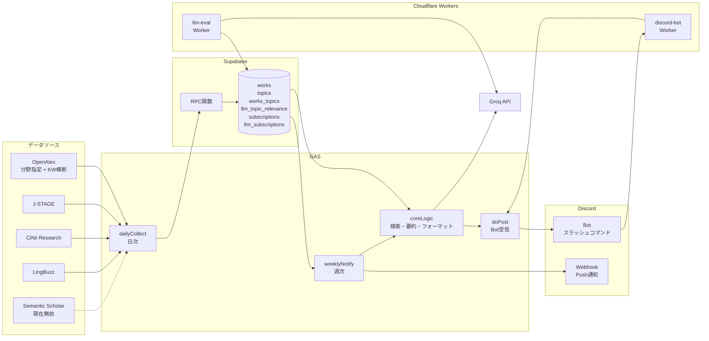
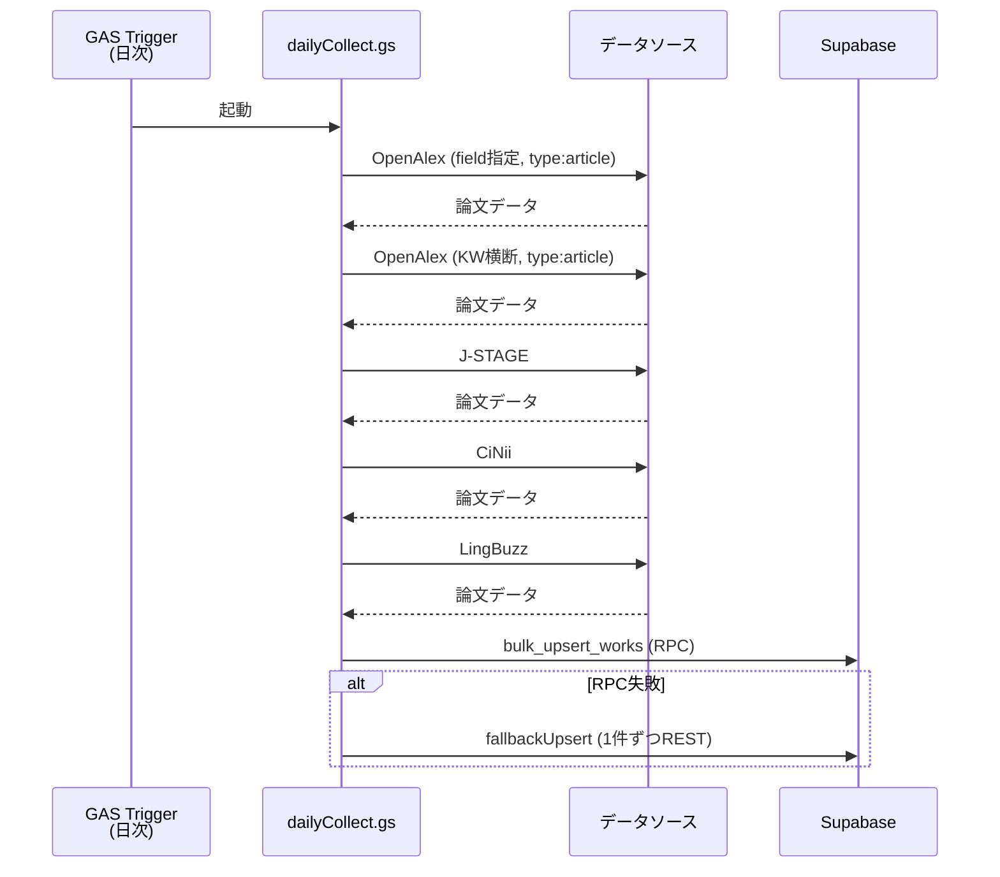
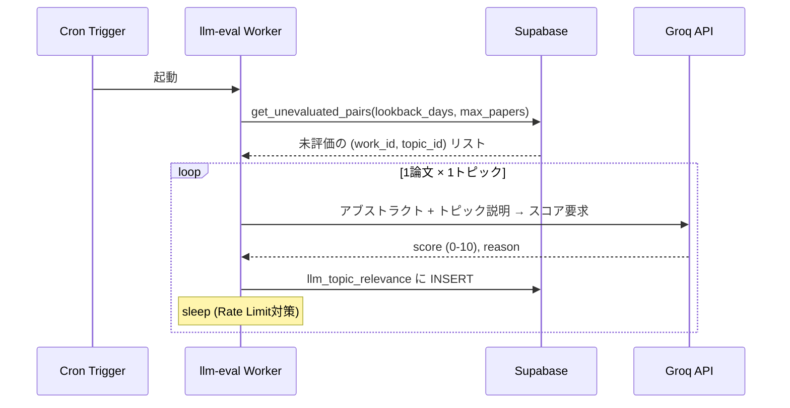
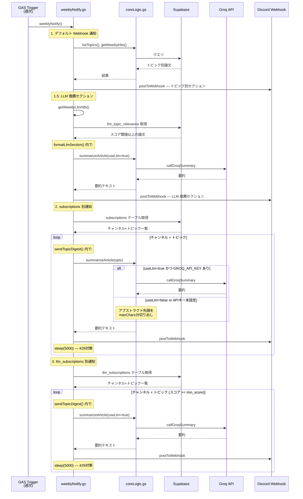
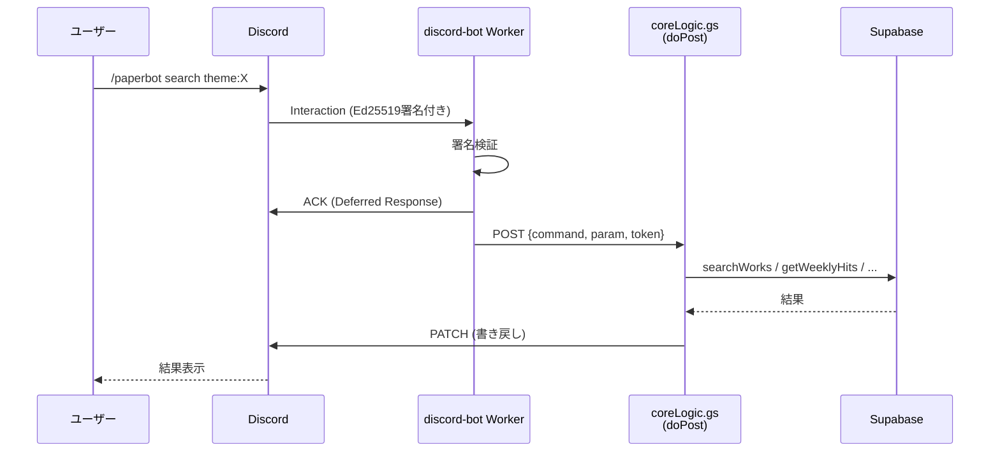
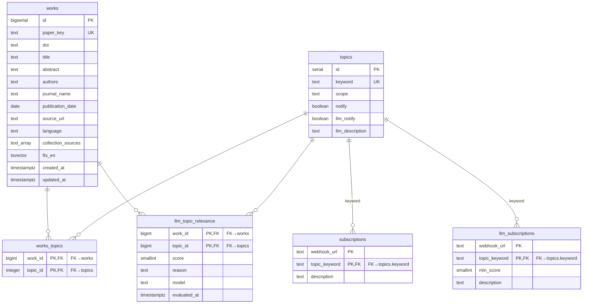

# アーキテクチャ

**要注意（信頼性）**: 
LLMの出力の一部分を確認・修正しましたが，全部見てはいません．
大まかな構成の参考として載せておきます．

## システム全体像

## 処理フロー

### 1. 日次収集（dailyCollect）

`dailyCollect` はファイル名（`dailyCollect.gs`）かつエントリポイントの関数名．各データソースの取得は専用関数に分離されている．

各ソースから取得した論文は `paper_key`（DOI or md5）で重複排除される．同一論文が複数ソースから来た場合，`collection_sources` 配列に追加される．

収集時にキーワードマッチングで `works_topics` への紐づけも行う．

#### 妥協点

- **J-STAGEのでの妥協**
  - `abst` の欠損 - J-STAGEのデータ取得で使ったAPIでは，「抄録」が[マニュアル](https://www.jstage.jst.go.jp/static/files/ja/manual_api.pdf)上のレスポンスフォーマットには見当たらなかった．個別の書誌情報では獲得できるが，今回は，工数等を考え，空欄を許容した．
  - `publication_date` での妥協 - J-STAGEのデータ取得で使ったAPIでは，`pubyear` で出版年は取得できるものの，月・日はマニュアル上のレスポンスフォーマットに見当たらなかった．個別の書誌情報では獲得できるが，今回は，工数等を考え，代用として `updated` を用いることとした．実際の出版日と異なることに注意．
  

### 2. LLM 関連度評価（llm-eval Worker）

1論文×1トピック=1呼び出しとしている理由は `docs/design-decisions.md` §3 に記載．

### 3. 週次通知（weeklyNotify）

通知は3段階で行われる．デフォルト Webhook（全トピック + LLM 推薦），`subscriptions`（キーワード部分一致ベース，チャンネル別），`llm_subscriptions`（LLM スコアベース，チャンネル別）．

### 4. Bot 系（Pull 型，任意）

Worker は署名検証と GAS への転送のみを担い，ロジックは GAS 側に集約されている．`token` が `"dummy"` の場合は Discord への書き戻しをスキップする（テスト用）．
`topic add` はDMだと動いても通常のチャンネルへのbot導入だと動かないかもしれない（権限周りによるかも？）．

## データモデル

`subscriptions` と `llm_subscriptions` は `topics.keyword` を FK としており，`topics.id` ではない点に注意．これにより keyword の変更時に CASCADE で追従する．

## コンポーネント間のデータ形式

| 経路 | 形式 |
|---|---|
| Workers → GAS | `{ command, param, mode, token, userId }` |
| GAS → Discord（Bot 書き戻し） | `PATCH /api/v10/webhooks/{app_id}/{token}/messages/@original` |
| GAS → Discord（Push 通知） | `POST` to Webhook URL |
| GAS → Supabase | PostgREST（REST API） / RPC |
| llm-eval Worker → Supabase | PostgREST（REST API） / RPC |
| llm-eval Worker → Groq | OpenAI 互換 API |
| GAS → Groq | OpenAI 互換 API |

## GAS ファイル構成と関数の所在

| ファイル | 主要関数 | 役割 |
|---|---|---|
| `dailyCollect.gs` | `dailyCollect`, `fetchOpenAlexPages`, `collectJstage`, `collectCinii`, `collectLingbuzz`, `fetchFromSupabase`, `postToSupabase`, `patchToSupabase`, `test_*`  | 収集 + DB操作インフラ + テスト |
| `coreLogic.gs` | `doPost`, `searchWorks`, `getWeeklyHits`, `fetchWeeklyByTopicId`, `listTopics`, `addTopic`, `removeTopic`, `backfillTopic`, `summarizeArticle`, `callGroqSummary`, `test_*` | コアロジック + テスト |
| `weeklyNotify.gs` | `weeklyNotify`, `sendTopicDigest`, `postToWebhook`, `getWeeklyLlmHits`, `formatLlmSection`, `test_*`  | 通知 + テスト |

`fetchFromSupabase`, `postToSupabase`, `patchToSupabase` は DB 操作の共通インフラ関数であり，`dailyCollect.gs` に定義されているが `coreLogic.gs` および `weeklyNotify.gs` からも呼び出される．将来的にはインフラ層として別ファイル（例: `infra.gs`）に分離することも検討できる．
